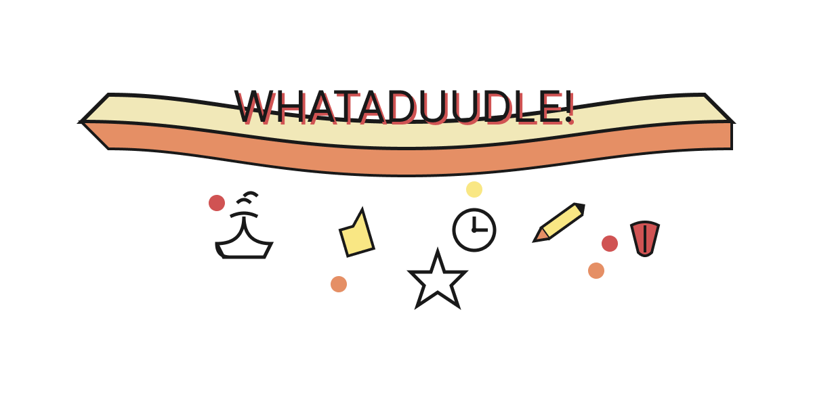
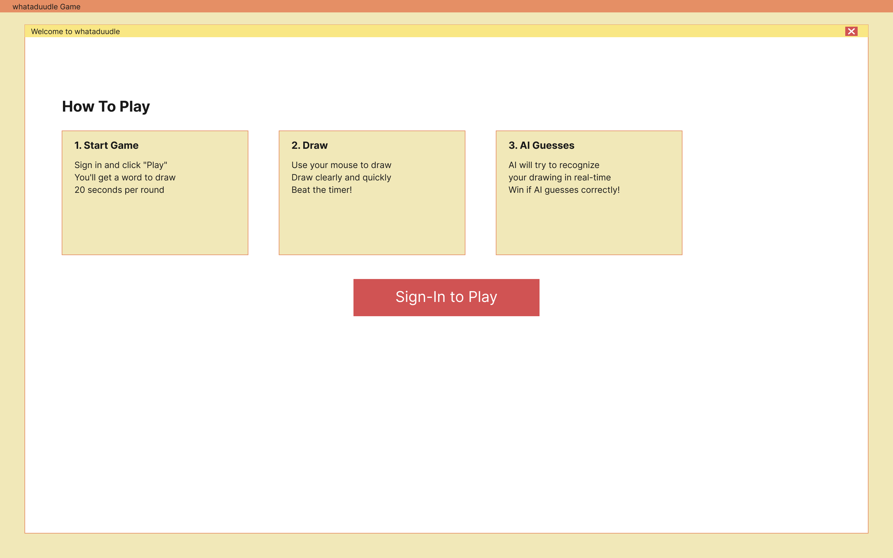
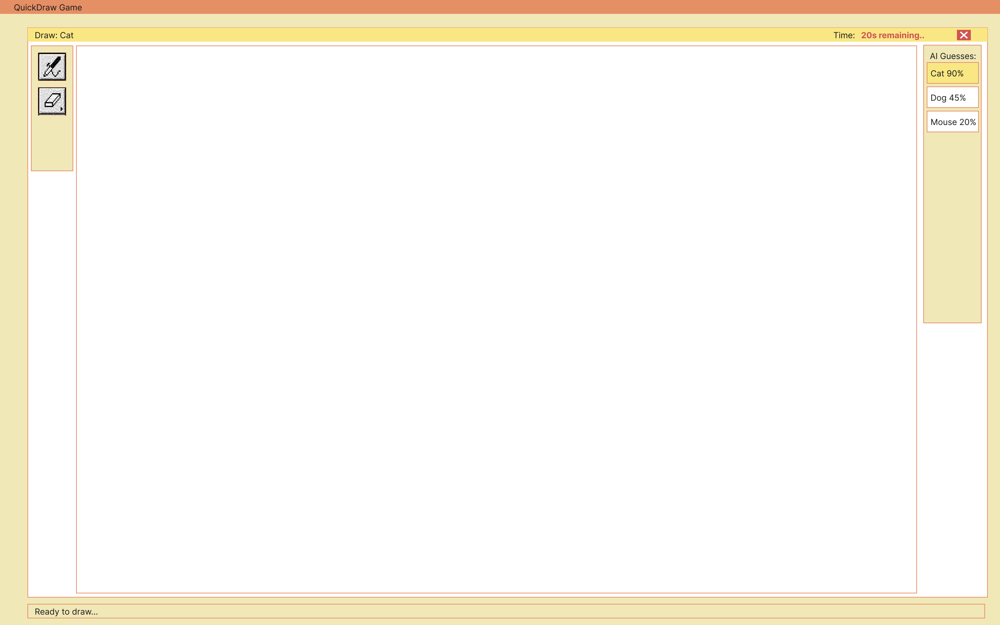

# **🤖 WHATADUUDLE! ✏️**



## Welcome to _whataduudle_ django project!

## Project Created By

- Mandy DeCamp
- Norman Lee
- Tim Lim
- Emmanuel Rosario
- NyuntSein

## **Technologies**

### **_FRONT-END_**

- Tailwind - CSS
- React
- Tensor Flow
- CanvasAPI
- Javascript
- Vite

**Visit _whataduudle_ front-end repository [here](https://github.com/Mandy2114/duudle-backend).**

### **_BACK-END_**

- Python
- Django
- POSTGRESQL
- Django REST Framework
- CORS
- rest_API

**Visit _whataduudle_ back-end repository [here](https://github.com/Mandy2114/duudle-backend).**

## What is **_WhatADuudle_**?

**_WhatADuudle_** is a drawing game where players can have an quick, exciting and fun time, testing their drawing skills.

**HOW TO PLAY**

1. Sign into your account! (Don't have one, sign-up for one!)
1. You will be automatically dropped into the canvas with your word.
1. Once you are ready, click **_'Start Drawing'_** and begin to draw within the time-limit.
1. Once timer is up, the computer will guess and if it guesses the drawing to the word provided, **YOU WIN!**
   Else You lose and you can try again
1. **\_**Repeat and HAVE FUN!!**\_**

## USER STORIES

- AAU I want to be able to sign-up for an account if wanted
- AAU I want to be able to sign-in and out.
- AAU I want to be able to see a landing page.
- AAU, when game is lost or win, i want to be able to replay.
- AAU, i want be able to draw my prompt.
- AAU, i want to see the time i have left and prompt while drawing.
- AAU, i want a fast and exciting round. 20 - 40 sec

---

<details>
<summary> ✨ FRONT-END AESTHETIC ✨ </summary>

#### WireFrame






#### Color Palette


```javascript
  theme: {
    extend: {
      colors: {
        'vanilla': {
          DEFAULT: '#f1e8b8',
          100: '#473e0e',
          200: '#8d7c1c',
          300: '#d4bb2a',
          400: '#e3d270',
          500: '#f1e8b8',
          600: '#f4edc5',
          700: '#f6f1d4',
          800: '#f9f6e2',
          900: '#fcfaf1'
        },
        'flax': {
          DEFAULT: '#f9e784',
          100: '#493f03',
          200: '#927d07',
          300: '#dbbc0a',
          400: '#f6da3c',
          500: '#f9e784',
          600: '#faec9e',
          700: '#fcf1b6',
          800: '#fdf6ce',
          900: '#fefae7'
        },
        'atomic-tangerine': {
          DEFAULT: '#e58f65',
          100: '#39190a',
          200: '#713313',
          300: '#aa4c1d',
          400: '#dc682e',
          500: '#e58f65',
          600: '#eaa785',
          700: '#efbda3',
          800: '#f5d3c2',
          900: '#fae9e0'
        },
        'indian-red': {
          DEFAULT: '#d05353',
          100: '#2e0d0d',
          200: '#5b1919',
          300: '#892626',
          400: '#b73232',
          500: '#d05353',
          600: '#d97575',
          700: '#e39898',
          800: '#ecbaba',
          900: '#f6dddd'
        },
        'eerie-black': {
          DEFAULT: '#191919',
          100: '#050505',
          200: '#0a0a0a',
          300: '#0f0f0f',
          400: '#141414',
          500: '#191919',
          600: '#474747',
          700: '#757575',
          800: '#a3a3a3',
          900: '#d1d1d1'
        }
      }
    }
  },
```

#### REACT Components


</details>

---

## Trello 📋

**Visit the [Trello board](https://trello.com/b/RlAy2kky/pics)**

Our Trello Board was really important

We used this as a way to organize our information, models, ideas and more. Allowing for a much more organized workflow.

## BACK-END

### Set-Up

1. Clone the repo
1. Run command environment
   </br>
   `pipenv shell`
   </br>
   and install the dependences...
   </br>
   `pipenv install`
   </br>
1. Create the Databases using this command. Make sure to uncomment the lines shown...
   </br>
   `psql -f create-database.sql`
   </br>
   
1. Once Created run these commands to make migrations for the models.
   </br>
   `python manage.py makemigrations`
   </br>
   </br>
   `python manage.py migrate`
   </br>
   - To see if migrations were succussful use the command...
     </br>
     `python manage.py showmigrationss `
     </br>
1. Run the server
   </br>
   `python manage.py runserver`
   </br>
1. Create An Admin for your database
   </br>
   `python manage.py createsuperuser`
   </br>
   - Fill out the username and password of your choosing. (Email field can be left blank).

## ERD


<details> 
<summary> POSTMVP </summary>

</details>
</br>

**User**

- **Id:** The identification number of a user. This is an auto-created field.
- **username:** The name that the user will be recognized as. (This is a String)
- **password:** A password created by the user in order to sign-in to their account. (This is a String)
- **email:** The email used to verify the user. (This is a String)

**Games**

- **Id:** The identification number of a game. This is an auto-created field.
- **status:** The status of the game. Whether a game is in session or has ended. (This is a Boolean)
- **current_word:** The word that the user will try to replicate. (This is a String)
- **Winner:** The identifier to see if the user has made a sufficient drawing that matches the word. (This is a Boolean)
- **date_played:** The date the game was played. (This is a time-stamp).

**Word**

- **Id:** The identification number of a word. This is an auto-created field.
- **game_id:** (Foreign Key) References the Game Id.
- **prompt:** The word that will be shown to the user. (This is a String)

**Drawing**

- **Id:** The identification number of a drawing. This is an auto-created field.
- **game_Id:** (Foreign Key) References the Game Id.
- **drawing:** The drawing that the user will draw. This will be store as JSON, to save space.

### Routes/Paths


## User Endpoints

### User Sign-Up

- **Endpoint:** `/users/register/`
- **Method:** `POST`
- **Description:** Creates a new user account.
  </br>
  

### User Login

- **Endpoint:** `/users/login/`
- **Method:** `POST`
- **Description:** Authenticates a user and returns a token.
  </br>
  

## Game Endpoints

### List of Games

- **Endpoint:** `/games/`
- **Method:** `GET`
- **Description:** Retrieves a list of all games.
  </br>
  

### Individual Game

- **Endpoint:** `/games/<game_id>/`
- **Method:** `GET`
- **Description:** Retrieves details of a specific game.
  </br>
  

## Word Endpoints

### List of Words

- **Endpoint:** `/words/`
- **Method:** `GET`
- **Description:** Retrieves a list of all words.
  </br>
  

### Individual Word

- **Endpoint:** `/words/<word_id>/`
- **Method:** `GET`
- **Description:** Retrieves details of a specific word.
  </br>
  

### Start a Game

- **Endpoint:** `/words/<word_id>/games/`
- **Method:** `POST`
- **Description:** Starts a new game with the specified word.
  </br>
  

## Drawing Endpoints

### List of Drawings for a Game

- **Endpoint:** `/games/<game_id>/drawings/`
- **Method:** `GET`
- **Description:** Retrieves a list of drawings for a specific game.
  </br>
  

### Add Drawing to a Game

- **Endpoint:** `/games/<game_id>/drawings/`
- **Method:** `POST`
- **Description:** Adds a new drawing to a specific game.
  </br>
  

## Game Update Endpoints

### Player Passed

- **Endpoint:** `/games/<game_id>/`
- **Method:** `PATCH`
- **Description:** Updates the game state to indicate a player has passed.

### Update Game State

- **Endpoint:** `/games/<game_id>/`
- **Method:** `PATCH`
- **Description:** Updates the game state with a new word, difficulty, and winner information.
  </br>
  

## Models

### Word

- **Prompt (CharField):**
- **Difficulty (CharField):**

### Game

- **result (BooleanField):**
- **word (ManytoManyField):**
- **user (OneToOneField):**
- **created_at (DateTimeField):**
- **difficulty (CharField):**

### Drawing

- **game (OneToOneField):**
- **art (TextFirld):**

## Views

#### Home(APIView)

- **Purpose:** Show home page..

#### CreateUserView(generics.CreateAPIView)

- **Purpose:** Creates a User When registers
- **Request:** (POST)

#### LoginView(APIView)

- **Purpose:** User login page logic
- **Request:** (POST)

#### VerifyUserView(APIView)

- **Purpose:** Check an authentication for user.
- **Request:** (GET)

#### GameDetails(generics.RetrieveUpdateDestroyAPIView)

- **Purpose:** Create a game.
- **Request:** (POST)(GET)(PUT)

#### GameDetails(generics.RetrieveUpdateDestroy)

- **Purpose:** Get the details of a game
- **Request:** (GET)(PUT)/(DELETE)

#### WordList(generics.ListCreateAPIView)

- **Purpose:** The List of Words
- **Request:** (POST)

#### WordDetail(generics.RetrieveUpdateDestroyAPIView)

- **Purpose:** A single word's details.
- **Request:** (GET)(PUT)/(DELETE)

#### WordGame(generics.CreateAPIView)

- **Purpose:** Creates a Game with a word attached to it. **(START GAME)**
- **Request:** (POST)

#### DrawingList(generics.ListCreateAPIView)

- **Purpose:** List of Drawings
- **Request:** (POST)(POST)

#### DrawingDetails(APIView)

- **Purpose:** Details of a Drawing.
- **Request:** (POST)(PUT)(DELETE)
